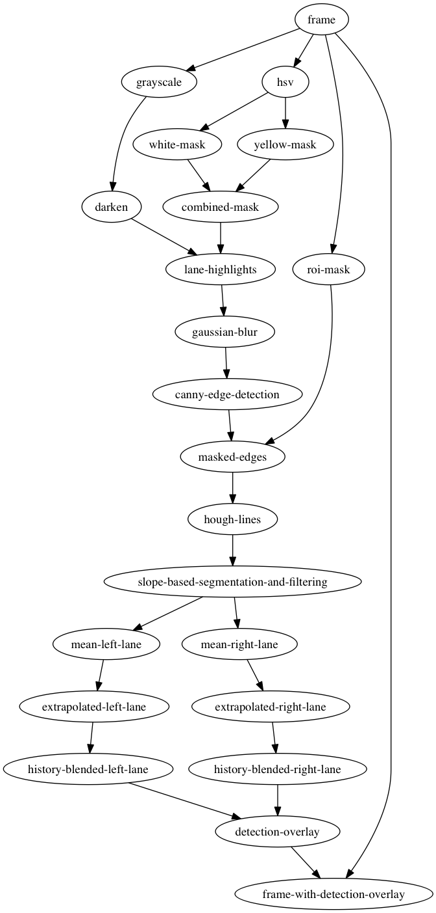
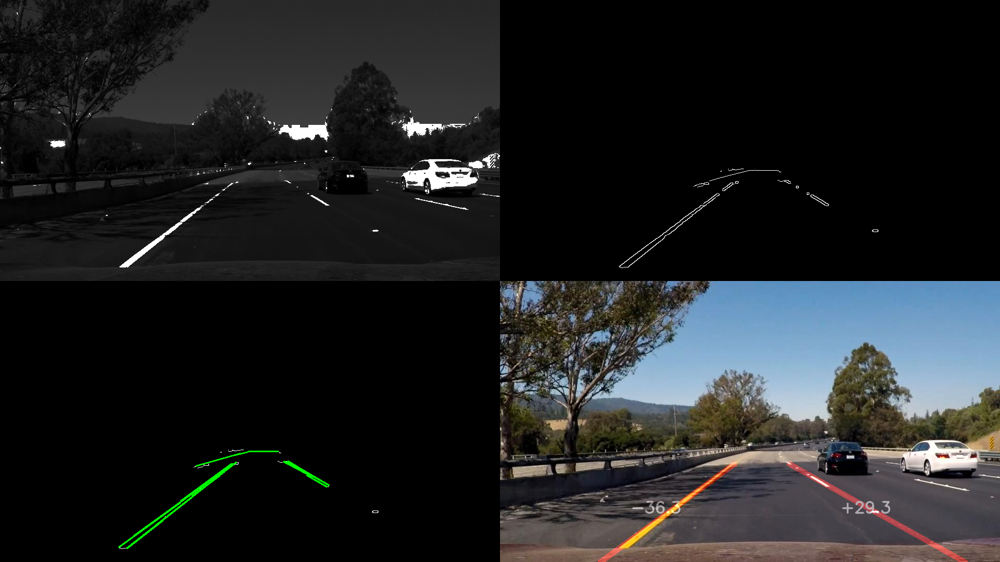
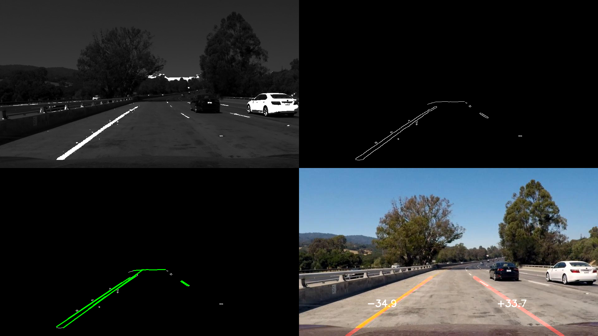
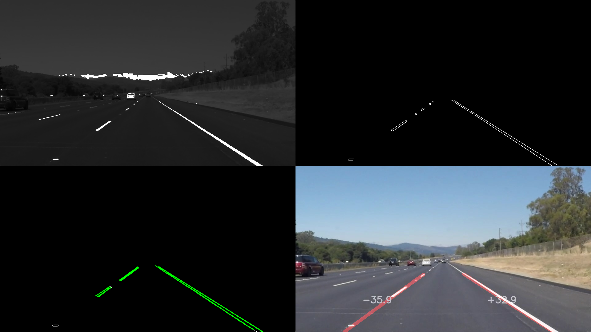

# Finding Lane Lines on the Road

## Reflection

## 1\. The Pipeline

I attempted to produce a minimum viable product first. This pipeline was implemented quickly based on the material from the course and I was able to detect lanes in the test images without any problem. I had to play with the pipeline parameters a bit but this was straightforward.

In the process, the function draw_lines() was modified to do the following:

1. Segment lines into left and right based on slope
2. Find the mean line that represented the left lines and right lines
3. Find slope and y-intercept of the mean line (`linsolve([m * x_1 + b - y_1, m * x_2 + b - y_2], m, b)`)
4. Extrapolated the mean lines for better visualization based on (`x = (y - b)/m`)

I was then able to apply the lane detection pipeline to the videos as required in the project. At this point, I implemented history based smoothing of lane markers and I was quite happy with the results.

After completing the basic requirements, I started working on the challenge and found that my pipeline is failing in certain places. I did the following to come up with a better solution.

1. Explored OpenCV documentation for ideas
2. Built classes to represent images, lines, lane-detection, image-processing, etc.
3. Built an interactive UI for tuning the pipeline parameters
4. Experimented with different edge detection techniques (sobel, laplacian, etc.)
5. Experimented with histogram equalization (equalizeHist, CLAHE, etc.)
6. Decided to add a hue/saturation/brightness range filter
7. Darkened the grayscale image enough to highlight the color mask yet allow detection of prominent features
8. Added a debug flag to troubleshoot things
9. Did just enough tuning to satisfy the challenge

Here is a diagram that describes my improved pipeline.

At this point I was happy with the pipeline in the context of the challenge. The following are some images that describes the performance of the pipeline.

## 2\. Potential Shortcomings

One potential failure mode would be when the lanes are no longer marked on the road. Current implementation will depend on the lane history when lanes cannot be detected from the incoming frames. This is not acceptable for production use and the pipeline should also produce some sort of confidence metrics.

Another failure mode is the changes in the ambient light. I feel the pipeline will not be very happy with a darker image of the road ahead. I played with histogram equalization to address this but this needs more tuning and I left that for later.

Although this pipeline seems to perform well on the test images provided (and some of my own images), I feel that it isn't a representative sample of what it might encounter in the wild wild world out there, which makes it dangerous to use in production.

In general, I feel that a lane detector must publish its confidence level continuously so that other parts of the vehicle can choose to depend on it or not (assuming there is redundancy and other kinds of sensors to depend on or that it can come to a safe stop or switch to manual drive).

## 3\. Possible Improvements

An essential improvement is to maintain a confidence value and return this to the caller. The confidence must keep reducing if lanes cannot be detected in the incoming frames. I feel very important for the safety of the passengers or the cargo.

I feel we should also attempt to associate a probability with individual lane lines that the pipeline detects. This must be possible with statistical techniques or with the help of a machine learning model. I feel we should also be able to label other lanes that the pipeline might detect based on its position/visual appearance, etc. to make things more robust.

In the current form, a possible improvement to the pipeline would be to tune it more with a wider spectrum of test images. This can be implemented in different ways. One option is to manually "label" a corpus of input images and use grid search on the lane-detection parameters to find optimal values. The error can be estimated as a mean square error of the pixels, for example. Another option is to make it a game and crowd-source tuning parameters!

Another incremental improvement is to make use of the area between the lanes to estimate the missing lane or to check the correctness of the detected lanes. I feel transforming the image to "top view" will enable more creative exploration of the frame. I will stop here for now because that seems to be one of the things coming up in the syllabus!
